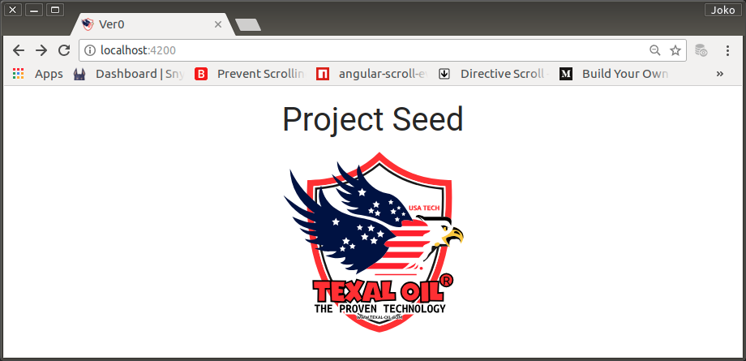

# DEFAULT SEED

## Instalasi

Envo-check dan instalasi project-seed di `/projects/texal` dengan nama direktori `/ver0`

```bash
$ lsb_release -a

No LSB modules are available.
Distributor ID:	Ubuntu
Description:	Ubuntu 14.04.5 LTS
Release:	14.04
Codename:	trusty

$ npm -v

6.0.1

$ node -v

v8.10.0
 
$ ng -v

    _                      _                 ____ _     ___
   / \   _ __   __ _ _   _| | __ _ _ __     / ___| |   |_ _|
  / △ \ |  _ \ / _  | | | | |/ _  |  __|   | |   | |    | |
 / ___ \| | | | (_| | |_| | | (_| | |      | |___| |___ | |
/_/   \_\_| |_|\__, |\__,_|_|\__,_|_|       \____|_____|___|
               |___/
    
Angular CLI: 1.7.4
Node: 8.10.0
OS: linux x64
Angular: 5.2.11
... animations, common, compiler, compiler-cli, core, forms
... http, language-service, platform-browser
... platform-browser-dynamic, router

@angular/cli: 1.7.4
@angular-devkit/build-optimizer: 0.3.2
@angular-devkit/core: 0.3.2
@angular-devkit/schematics: 0.3.2
@ngtools/json-schema: 1.2.0
@ngtools/webpack: 1.10.2
@schematics/angular: 0.3.2
@schematics/package-update: 0.3.2
typescript: 2.5.3
webpack: 3.11.0

$ cd projects/texal
$ ng new ver0

WARN:

npm WARN deprecated nodemailer@2.7.2: All versions below 4.0.1 of Nodemailer are deprecated. See https://nodemailer.com/status/
npm WARN deprecated mailcomposer@4.0.1: This project is unmaintained
npm WARN deprecated socks@1.1.9: If using 2.x branch, please upgrade to at least 2.1.6 to avoid a serious bug with socket data flow and an import issue introduced in 2.1.0
npm WARN deprecated uws@9.14.0: stop using this version
npm WARN deprecated node-uuid@1.4.8: Use uuid module instead
npm WARN deprecated buildmail@4.0.1: This project is unmaintained
npm WARN deprecated socks@1.1.10: If using 2.x branch, please upgrade to at least 2.1.6 to avoid a serious bug with socket data flow and an import issue introduced in 2.1.0

npm WARN optional SKIPPING OPTIONAL DEPENDENCY: fsevents@1.2.4 (node_modules/fsevents):
npm WARN notsup SKIPPING OPTIONAL DEPENDENCY: Unsupported platform for fsevents@1.2.4: wanted {"os":"darwin","arch":"any"} (current: {"os":"linux","arch":"x64"})

added 1219 packages from 1264 contributors in 94.788s
[!] 19 vulnerabilities found [7522 packages audited]
    Severity: 1 Low | 17 Moderate | 1 High
    Run `npm audit` for more detail

Project 'ver0' successfully created.
```

Wow, ada banyak vulnerabilities. Dan bahkan ada 1 yang high-priority.

Setelah cari informasi sana-sini, ternyata npm versi sekarang ada fitur audit untuk vulnerabilities dan ada petunjuk berikut:

> If you have ran npm audit and got vulnerabilities, then you can have different scenarios:
>
> ### Security vulnerabilities found with suggested updates 
>
> - Run the npm audit fix subcommand to automatically install compatible updates to vulnerable dependencies.
>
> - Run the recommended commands individually to install updates to vulnerable dependencies. (Some updates may be semver-breaking changes; for more information, see "SEMVER warnings".)
>
> ### Security vulnerabilities found requiring manual review
>
>If security vulnerabilities are found, but no patches are available, the audit report will provide information about the vulnerability so you can investigate further.
>
> Source: [Reviewing and acting on the security audit report](https://docs.npmjs.com/getting-started/running-a-security-audit#reviewing-and-acting-on-the-security-audit-report)


### Vulnerabilities resolving

Pertama saya mencoba:

```bash
$ npm audit fix
```

Tetapi hasilnya tetap:

```bash
[!] 19 vulnerabilities found - Packages audited: 7522 (7500 dev, 1507 optional)
    Severity: 1 Low | 17 Moderate | 1 High
```

Untung hasil audit (npm audit security report) menunjukkan adanya kemungkinan update secara manual pada sebagian package yang menyebabkan adanya vulnerabilities. Yang lain, saya kelihatannya harus membaca `manual-review` dulu sebelum mampu melakukan solusi.

```bash
- # Run  npm install --dev protractor@5.3.2  to resolve 5 vulnerabilities
- # Run  npm update request --depth 5  to resolve 8 vulnerabilities
```

```bash
$ npm install --dev protractor@5.3.2

npm WARN install Usage of the `--dev` option is deprecated. Use `--only=dev` instead.

added 9 packages from 11 contributors, removed 5 packages and updated 6 packages in 28.713s
[!] 18 vulnerabilities found [7533 packages audited]
    Severity: 1 Low | 17 Moderate
    Run `npm audit` for more detail
```

Hanya berkurang 1. Tetapi yang high-priority (denial of service) sudah hilang.

Saya ulangi dengan `--only=dev`

```bash
$ npm install --only=dev protractor@5.3.2

updated 1 package in 20.221s
[!] 18 vulnerabilities found [7533 packages audited]
    Severity: 1 Low | 17 Moderate
    Run `npm audit` for more detail
```

Hasilnya sama saja.

Setelah saya audit lagi,

```bash
$ npm aufit fix
```

Tidak ada fixing, tetapi warning recommendation berubah menjadi:

```bash
- # Run  npm update request --depth 5  to resolve 12 vulnerabilities
```

```bash
$ npm update request --depth 5

added 10 packages from 17 contributors and updated 6 packages in 22.545s
[!] 6 vulnerabilities found [7555 packages audited]
    Severity: 1 Low | 5 Moderate
    Run `npm audit` for more detail
```

> Tinggal vulnerabilities yang resolvingnya harus melihat petunjuk npm audit guide. Saya mencoba solusi untuk melakukan resolves dengan membaca di [sini](https://go.npm.me/audit-guide) , tetapi masih belum paham dan saya tinggalkan dulu masalah ini untuk disolusikan di masa yang akan datang.


### Git & Running check!

Sebuah project seed selalu disertai dengan git initialisation yang telah di commit oleh Angular Developer

```bash
$ git log

commit 40a3b30f57c566c7ceb8ded5ee7a2af6c03a59f2 (HEAD -> master)
Author: Angular CLI <angular-cli@angular.io>
Date:   Thu May 31 21:58:57 2018 +0700

    chore: initial commit from @angular/cli
    
        _                      _                 ____ _     ___
       / \   _ __   __ _ _   _| | __ _ _ __     / ___| |   |_ _|
      / △ \ |  _ \ / _  | | | | |/ _  |  __|   | |   | |    | |
     / ___ \| | | | (_| | |_| | | (_| | |      | |___| |___ | |
    /_/   \_\_| |_|\__, |\__,_|_|\__,_|_|       \____|_____|___|
                   |___/
```

Dicoba:

```bash
$ ng serve
** NG Live Development Server is listening on localhost:4200, open your browser on http://localhost:4200/ **
Date: 2018-05-31T16:14:25.194Z                                                          
Hash: 741d60a397a2cd370162
Time: 16268ms
chunk {inline} inline.bundle.js (inline) 3.85 kB [entry] [rendered]
chunk {main} main.bundle.js (main) 17.9 kB [initial] [rendered]
chunk {polyfills} polyfills.bundle.js (polyfills) 555 kB [initial] [rendered]
chunk {styles} styles.bundle.js (styles) 41.5 kB [initial] [rendered]
chunk {vendor} vendor.bundle.js (vendor) 7.43 MB [initial] [rendered]

webpack: Compiled successfully.
```

<p align="center">
	
    <br />
    Figure: 000-a-project-seed.png
</p>


## Memasang Materialize

Terkait dengan UX (User Experience), aplikasi ini harus menerapkan prinsip-prinsip Google Material Design.

Untuk kepentingan tersebut, saya memutuskan untuk menggunakan CSS framework yang bernama MaterializeCSS (di dokumentasi akan disebut sebagai materialize saja). Walau Materialize memiliki ketergantungan terhadap jQuery, HammerJS dan velocity.js, saya menetapkan framework ini sebagai pilihan saya. Menurut saya, framework ini cukup komprehensif, dokumentasinya lengkap, tidak kaku dan mudah digunakan.

### Implementasi

0. Saya merujuk ke

    https://github.com/InfomediaLtd/angular2-materialize<br/>
    https://www.npmjs.com/package/angular2-materialize

    Dan demo-nya di:

    https://infomedialtd.github.io/angular2-materialize

    Situs resmi materialize sendiri ada di:

    http://materializecss.com

1. Install MaterializeCSS and angular2-materialize from npm

    ```bash
    $ npm install materialize-css --save
    $ npm install angular2-materialize --save
    ```
2. Walau kemungkinan pemakaian jQuery sangat kecil, karena materialize membutuhkan jQuery maka ybs saya install. Bersama dengan Hammer.JS sebagai dependensi:

    ```bash
    $ npm install jquery@^3.3.1 --save
    $ npm install @types/jquery --save
    $ npm install hammerjs --save
    $ npm install @types/hammerjs --save
    ```

    > Komando ke 2 dan ke 4 di atas digunakan untuk mengenalkan library yang bersangkutan ke typescript.
    >
    > Dalam petunjuk, versi jquery yang diminta adalah ^2.4.1 tetapi saya memutuskan untuk menggantinya dengan jquery@^3.3.1, karena saya pernah mencoba, jika menggunakan jquery versi rendah di angular versi tinggi, ada beberapa swipe events tidak bisa bekerja dengan baik di mobile device.

3. Edit the angular-cli.json

    - Membuka bagian apps dan cari `styles` array di dalamnya (dengan hanya `styles.css` sebagai nilai default). Saya timpa default value ini dengan value di bawah ini dan file `/style.css` dihapus.

        ```json
        "../node_modules/materialize-css/dist/css/materialize.css"
        ```

    - Pergi ke bagian `apps` dan temukan `scripts` array di dalamnya, dan tambahkan baris-baris berikut ke dalam array

        ```json
        "../node_modules/jquery/dist/jquery.js",
        "../node_modules/hammerjs/hammer.js",
        "../node_modules/materialize-css/dist/js/materialize.js"
        ```

4. Tambahkan di bagian atas `./src/app/app.module.ts`:

    ```typescript
    import { MaterializeModule } from 'angular2-materialize';
    ```

5. Di `app.module.ts`, tambahkan `MaterializeModule` di dalam import array `@NgModule` dekorator.

6. Dicoba dengan restart ng serve.

    ```bash
    $ ^C
    $ ng serve
    ```

    Hasilnya, font telah menjadi berubah. Setelah saya amati di `./node_modules/materialize-css` ternyata menggunakan `roboto` fonts

<p align="center">
	
    <br />
    Figure: 000-b-project-seed-materialize.png
</p>

## Memasang Google Icon Fonts untuk Materialize di `./src/assets/`

0. Untuk memenuhi kebutuhan materialize, dibutuhkan google icon fonts. Dan setelah browsing, saya temukan url-nya di:

    https://github.com/google/material-design-icons/tree/master/iconfont

    Tetapi karena di repository tersebut nerupakan sub-direktori, tidak dapat didownload begitu saja. Github untuk saat ini tidak mendukung fitur tersebut.
    
    Setelah eksplorasi beberapa saat akhirnya diketemukan solusinya. Yaitu dengan menggunakan subversion/svn.

    Url-syntax: `svn export https://github.com/USER/PROJECT/trunk/PATH DEST`

    ```bash
    $ sudo apt-get install subversion
    $ mkdir src/assets/fonts/
    $ cd src/assets/fonts/
    $ svn export https://github.com/google/material-design-icons/trunk/iconfont
    $ mv iconfont google-2.2.0
    $ cd ../
    $ tree fonts/

    fonts/
    └── google-2.2.0
        ├── codepoints
        ├── material-icons.css
        ├── MaterialIcons-Regular.eot
        ├── MaterialIcons-Regular.ijmap
        ├── MaterialIcons-Regular.svg
        ├── MaterialIcons-Regular.ttf
        ├── MaterialIcons-Regular.woff
        ├── MaterialIcons-Regular.woff2
        └── README.md

    1 directory, 9 files

    $ cd ../../
    ```

1. Memasang google icon fonts di ./index.html

    ```html
    <link rel="stylesheet" href="./assets/fonts/google-2.0.0/material-icons.css">
    ```

    > `src/` adalah current directory.

## Mengganti favicon dan viewport meta tag.

0. Mengganti meta tag untuk viewport di ./index.html

    Semula:

    `<meta name="viewport" content="width=device-width, initial-scale=1">`

    Diganti:

    <meta name="viewport" content="user-scalable=no, width=device-width, initial-scale=1, maximum-scale=1">

1. Update `.angular-cli.json

    Menghilangkan `"favicon.ico"` di apps.assets property dan menghapus image file-nya di `./`

    ```bash
    $ rm src/favicon.ico
    ```

2. Membuat texal logo agar memperoleh images untuk favicon.

    Mengambil dan download texal-logo yang masih bitmap di `http://two.texal-oil.com/` 

    Semua images diletakkan direktori khusus untuk artwork di application directory `ver0/` (saat di lingkungan produksi harus dieliminasi atau dipindahkan di tempat lain) dengan nama sesuai dengan peruntukkannya. Sedangkan hasilnya, diletakkan di `./assets/images/<nama-image>/vN.ext`

    ```bash
    $ mkdir artworks/logo -p
    $ cd artworks/logo/
    $ wget http://two.texal-oil.com/images/logo-new_1.png
    ```

    Kemudian melakukan manual tracing dengan bantuan `inkscape` untuk menghasilkan logo berbasis vector (svg) dan disimpan sebagai `v0.svg` (version 0)

    ```bash
    $ cd .. # ke artworks/
    $ mkdir favicons/
    $ cp logo/v0.svg favicons/favicon.svg
    ```

    `favicon.svg` diupdate, dikurangi beberapa object yang terlalu kecil jika digunakan sebagai favicon dengan bantuan inkscape (GUI).

    Setelah selesai, langsung di-convert lewat command line agar menjadi `.png`.

    ```bash
    $ cd favicons/
    $ inkscape favicon.svg -e favicon.png
    ```

    Kemudian `favicon.png` di-convert dalam berbagai ukuran (16, 60, 76, 120, 152).

    ```bash
    $ convert favicon.png -resize 16x16 16.png
    $ convert favicon.png -resize 60x60 60.png
    $ convert favicon.png -resize 76x76 76.png
    $ convert favicon.png -resize 120x120 120.png
    $ convert favicon.png -resize 152x152 152.png
    $ rm favicon.png
    ```

    Dan akhirnya semua hasilnya (`.png`) di-merge ke favicon.ico dan diletakkan di `./assets/images/` bersama-sama dengan file-file `.png` yang bersangkutan.

    ```bash
    $ icotool -c 16.png 60.png 76.png 120.png 152.png -o favicon.ico
    $ cd ../../ # ke ver0/ project root
    $ mkdir src/assets/images/favicons/ -p
    $ cp artworks/favicons/*.png src/assets/images/favicons/
    $ cp artworks/favicons/*.ico src/assets/images/favicons/
    ```

3. Membuat link ke favicon di `./index.html` untuk beberapa kemungkinan type browser dan screen dpi.

    ```html
    <link rel="icon" type="image/x-icon" href="favicon.ico">
    <link rel='shortcut icon' href='./assets/images/favicons/favicon.ico'>
    <link rel='shortcut icon' href='./assets/images/favicons/16.png'>
    <link rel='apple-touch-icon' sizes='60x./assets/60' href='./assets/images/favicons/60.png'>
    <link rel='apple-touch-icon' sizes='76x76' href='./assets/images/favicons/76.png'>
    <link rel='apple-touch-icon' sizes='120x120' href='./assets/images/favicons/120.png'>
    <link rel='apple-touch-icon' sizes='152x152' href='./assets/images/favicons/152.png'>
    ```

<p align="center">
	
    <br />
    Figure: 000-c-project-seed.png
</p>


## Berganti view untuk page-body (`app.component` template)

Texal Project Seed hanya akan menyisakan app.component yang menampilkan logo dan tulisan `Project Seed` sebagai title.

1. Menyalin logo images dari `artworks/` ke `./assets/images/logo

    ```bash
    $ mkdir src/assets/images/logo/ -p
    $ cp artworks/logo/v0.svg src/assets/images/logo/
    ```

2. Merubah `app.component` template

    `app.component` template

    ```html
    <div style="text-align:center">
        <h2>Project Seed</h2>
        
    </div>
    ```

<p align="center">
	
    <br />
    Figure: 000-d-project-seed.png
</p>

## Commit

```bash
$ git log --oneline

40a3b30 (HEAD -> master) chore: initial commit from @angular/cli

$ git add .
$ git commit -m "Project Seed"
$ git push -u origin master
```