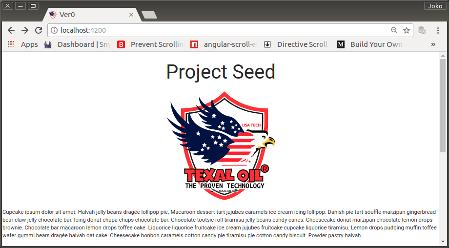

# Experimental Lorem Ipsum

Selama pengembangan, akan banyak dibutuhkan dummy-content untuk beberapa component tertentu. Untuk itu, ke dalam akan saya sediakan sebuah component baru bernama LoremComponent dan dimasukkan ke dalam ExperimentalModule.

Component ini akan menggantikan penulisan `lorem ipsum` secara hardcoded yang biasa dilakukan oleh para pengembang. Dengan penerapan yang seperti ini, berarti saya telah memenuhi salah satu prinsip modularity (separation of concern).

## Membuat LoremComponent

0. Dibuat dengan pertolongan angular-cli

    ```bash
    $ ng generate component experimental/lorem
    ```

1. Agar dapat digunakan oleh component lain di luar module yang bersangkutan, LoremComponent diexport oleh ExperimentalModule.

    ```typescript
    import { NgModule } from '@angular/core';
    import { CommonModule } from '@angular/common';
    import { LoremComponent } from './lorem/lorem.component';

    @NgModule({
        imports: [
            CommonModule
        ],
        declarations: [
            LoremComponent
        ],
        exports: [
            LoremComponent
        ],
    })
    export class ExperimentalModule { }
    ```

2. Mengisi LoremComponent dengan `lorem ipsum`

    ```html
    <div id="lorem">
        <p>
            Cupcake ipsum ...
        </p>
        <p>
            Bonbon cheesecake ...
        </p>
        <p>
            Pudding cheesecake ...
        </p>
        <p>
            Danish jujubes ...
        </p>
        <p>
            Tootsie roll ...
        </p>
    </div>
    ```

3. Mencoba menggunakannya di AppComponent.

    `AppComponent` template

    ```html
    <div style="text-align:center">
        <h2>Project Seed</h2>
        
    </div>
    <app-lorem></app-lorem>
    ```

<p align="center">
	
    <br />
    Figure: 002-a-lorem-ipsum.png
</p>

## Commit

```bash
$ git log --oneline

b8df69e (HEAD -> master, origin/master) Experimental Feature Module
c0e2efc Project Seed
40a3b30 chore: initial commit from @angular/cli

$ git add .
$ git commit -m "Experimental Lorem Ipsum"
$ git push -u origin master
```