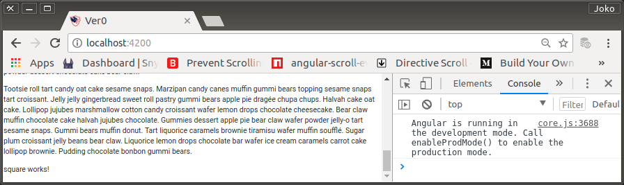
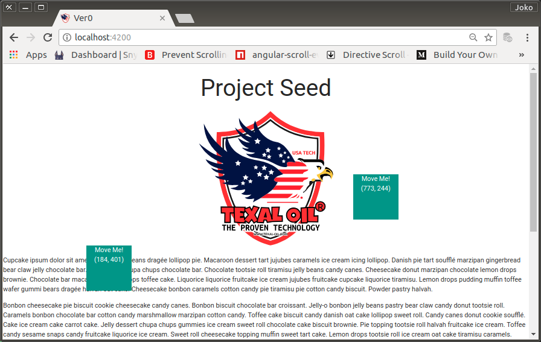

# Experimental Draggable Square

Nantinya, pada aplikasi akan banyak ditemui object yang harus `draggable`. Dan bisa dideteksi posisi akhir drag a.k.a `drag'n drop`.

Saya akan membuat sebuah square yang dapat di drag di manapun di atas browser workspace.

Specification Requirement:

0. Square element berdimensi 50px
1. Origin position (0,0) atau top-left-corner browser's workspace
2. Berwarna latar lebih gelap dari lingkungannya
3. Di dalamnya (center aligned) ada tulisan 'Move Me!'
4. Di bawah 'Move Me!' terdapat koordinat element square dalam tanda kurung dan akan selalu berubah sesuai posisi square element (center aligned)
5. Dengan pertolongan HammerJS yang telah terinstall (Materialize dependency), square element dapat mendengar touch-event dan mouse event
6. Square element akan berpindah sesuai dengan pergerakan (pan) touch event
7. Hanya saat dalam keadaan touched (pressed) square menjadi pulsed.
8. Reusable.

## Implementasi

0. Pembuatan component dilakukan dengan angular-cli

    ```bash
    $ ng generate component /experimental/square
    ```

    SquareComponent akan terbentuk di `src/app/experimental/square/`.

    `SquareComponent` code

    ```javascript
    import { Component, OnInit } from '@angular/core';

    @Component({
        selector: 'app-square',
        templateUrl: './square.component.html',
        styleUrls: ['./square.component.css']
    })
    export class SquareComponent implements OnInit {

        constructor() { }

        ngOnInit() {
        }

    }
    ```

    Karena bagian dari `ExperimentalModule`, maka oleh `angular-cli` component secara otomatis akan diimport oleh di module tersebut.

    ```javascript
    import { NgModule } from '@angular/core';
    import { CommonModule } from '@angular/common';
    import { SquareComponent } from './square/square.component';

    @NgModule({
        imports: [
            CommonModule
        ],
        declarations: [SquareComponent],
    })
    export class ExperimentalModule { }
    ```

    > Catatan:
    >
    > Prefix dari selector-nya SquareComponent (dan component lain yang akan dibuat) selalu `app` dan selalu diperiksa oleh compiler. Perihal prefix ini serta bagaimana menggantinya telah dibahas di stackoverflow (https://stackoverflow.com/questions/41248142/angular2-how-to-change-the-default-prefix-of-component-to-stop-tslint-warnings).

2. Langkah menggunakan component dalam featured-module.

    Component harus di-export dulu oleh featured module ybs.

    `ExperimentalModule`

    ```javascript
    import { NgModule } from '@angular/core';
    import { CommonModule } from '@angular/common';

    import { LoremComponent } from './lorem/lorem.component';
    import { SquareComponent } from './square/scquare.component';

    @NgModule({
        imports: [
            CommonModule
        ],
        declarations: [LogoComponent],
        exports: [
            LoremComponent,
            SquareComponent
        ]
    })
    export class ExperimentalModule { }
    ```

    Setelah di-export, `AppComponent` bisa langsung menggunakan `SquareComponent` dengan meletakkan custom-directive dari `SquareComponent` di `AppComponent` template. Sengaja saya letakkan dua kali untuk membuktikan bahwa setiap component asal dibuat dengan seksama, akan dapat bersifat re-usable.

    `AppComponent` template

    ```html
    <div style="text-align:center">
        <h2>Project Seed</h2>
        
    </div>
    <app-lorem></app-lorem>
    <app-square></app-square>
    <app-square></app-square>
    ```

    > Saat dicoba, di dapati error message di browser's console. "Refused to apply style from  'http://localhost:4200/assets/fonts/google-2.0.0/material-icons.css'  because its MIME type ('text/html') is not a supported stylesheet MIME type, and strict MIME checking is enabled.". Ketidak-telitian di checkpoint sebelumnya.
    >
    > Ternyata saya tidak mencatumkan `type` untuk `<stylesheet>` tag di `./index.html`
    >
    > `<link rel="stylesheet"href="...">`.
    >
    > Seharusnya:
    >
    > `<link rel="stylesheet" type="text/html" href="...">`.
    
    Di bagian bawah setelah output dari LoremComponent terlihat output SquareComponent yang hanya berupa teks.

<p align="center">
	
    <br />
    Figure: 003-a-square-is-works.png
</p>

3. Setelah `AppComponent` berfungsi, tinggal ditambah dengan feature seperti permintaan desain,

    Buat `style` baru di `SquareComponent` stylesheet untuk square-element dengan properties sebagai berikut:

    `SquareComponent` style

    ```css
    .square {
        position: absolute;
        width: 100px; height: 100px;
        top: 0px; left: 0px;
        cursor: pointer;
    }
    ```

    > Note: style-class (.). Bukan style-id (#) karena bisa diterapkan kepada lebih dari satu element. 

    `SquareComponent` template

    ```html
    <div 
        class="teal white-text"
        [id]="squareId"
        [style.left.px]="x" [style.top.px]="y"
        (panstart)="onPanStart($event)"
        (panmove)="onPanMove($event)"
        (press)="onPress($event)"
        (pressup)="onPressUp($event)"
        (panend)="onPressUp($event)"
    >
        <div class="center-align">Move Me!</div>
        <div class="center-align">({{x}}, {{y}})</div>
    </div>
    ```

    - Setiap component instance Akan memiliki id yang berbeda karena akan dirujuk oleh bussines-logic yang ada di `SquareComponent` code.
    - `squareId` dicipta dengan formulasi 'square-' ditambah dengan 5 buah character yang dicipta secara random. Di real-world bisa jadi akan ditambah dengan data berupa array yang diterima dari server.
    - Posisi left dan top sesuai dengan nilai variable x dan y.
    - panstart event diresponse oleh fungsi onPanStart($event)
    - panmove event diresponse oleh fungsi onPanMove($event)
    - interpolasi {{x}} dan {{y}} untuk memberitahu kita posisi perubahan nilai x dan y.

    Dan

    - press event diresponse oleh fungsi onPress($event)
    - pressup dan panend event akan diresponse oleh fungsi onPressUp($event)
    
    Masing-masing dengan logic yang sesuai dengan tujuan.

4.  Update SquareComponent code menjadi sebagai berikut

    ```javascript
    import { Component, OnInit } from '@angular/core';

    @Component({
        selector: 'app-square',
        templateUrl: './square.component.html',
        styleUrls: ['./square.component.css']
    })
    export class SquareComponent implements OnInit {

        x = 0;
        y = 0;
        startX = 0;
        startY = 0;
        squareId = '';

        constructor() {
            this.squareId = 'square-' + Math.random().toString(36).replace(/[^a-z]+/g, '').substr(0, 5);
        }

        ngOnInit() {
            this.x = 0;
            this.y = 0;
        }

        onPanStart(event: any): void {
            event.preventDefault();
            this.startX = this.x;
            this.startY = this.y;
        }

        onPanMove(event: any): void {
            event.preventDefault();
            this.x = this.startX + event.deltaX;
            this.y = this.startY + event.deltaY;
            this.onPress(event);
        }

        onPress(event: any): void {
            event.preventDefault();
            document.getElementById(this.squareId).classList.add('pulse');
        }

        onPressUp(event: any): void {
            event.preventDefault();
            document.getElementById(this.squareId).classList.remove('pulse');
        }

    }
    ```
<p align="center">
	
    <br />
    Figure: 003-b-square-is-draggable.png
</p>

5.  Note:

    > Semua codes, templates dan styles diusahakan untuk less-comment a.k.a self-explained. 
    >
    > Nilai terakhir `x` dan `y` adalah nilai 'drop', untuk mengetahui drop itu tepat, tinggal mengujinya dengan lokasi destinasi.

## Commit

```bash
$ git log --oneline

0016ff7 (HEAD -> master, origin/master) Experimental Lorem Ipsum
b8df69e Experimental Feature Module
c0e2efc Project Seed
40a3b30 chore: initial commit from @angular/cli

$ git add .
$ git commit -m "Experimental Draggable Square"
$ git push -u origin master
```

