# Experimental Sidenav

Setiap ada component baru, sebaiknya dibuat sebagai experimental component terlebih dahulu. Akibat baik yang diperoleh adalah kemudahan saat sebuah project lain hendak mencari dan mengadopsi component tersebut. Developer dapat melihat dan mengikuti langkah-langkah kreasinya di dokumentasi untuk mempelajari kinerjanya, atau sekedar copy-paste code, template dan stylesheet setiap experimental component di repository tanpa perlu checkout.

Sidenav (Side Navigator) adalah bagian dari aplikasi dengan behaviour tertentu dan unik. Sebuah feature yang digunakan untuk melayani user untuk hop ke destinasi layanan lain di dalam aplikasi. UX design sangat diperhatikan dan content yang berupa sajian dapat berganti-ganti secara kontekstual dan dynamic.

Biasanya dipadukan dengan sajian utama yang ada di header sebuah page dan sebenarnya sudah tersedia di materialize. Tetapi, karena kompleksitas content, sidenav dirancang untuk secara tetap berada di aplikasi dan tidak dikaitkan dengan header. Seandainya header memiliki sajian yang harus disembunyikan saat berada di mobile device (narrow screen) maka sajian tersebut dapat dipindahkan ke bagian teratas dari sidenav's content .

Sesuai dengan namanya, pada saat tidak digunakan, sidenav posisinya tersembunyi di kiri browser's workspace (collapsed). Untuk menggunakannya, user dapat melakukan panning ke kanan terhadap sidenav tersebut. Panning dapat dilakukan dengan touch gesture maupun dengan mouse pointing. Implementasi animasi pergerakan saat panning di bantu oleh velocityJS dengan sangat memperhatikan prinsip-prinsip UX dari google material design.

## Requirement Specification

0. Secara default, div tersembunyi di sisi kiri browser's workspace atau disebut sebagai dalam keadaan collapsed
1. Sifatnya liquid, selalu berusaha menyamakan  dimensinya dengan windownya browser atau containernya.
2. User dapat melakukan panning untuk slide-in dan slide-out
3. Saat user melakukan panning ke kanan, liquid div tersebut akan bergerak mengikuti panning. Saat panend, div tersebut akan bergerak menuju posisi showed sampai menutup seluruh browser's workspace jika arah panning saat itu tetap ke kanan. Tetapi akan bergerak kembali ke kiri dan menjadi collapsed jika arah panning terakhir bergerak ke kiri. Demikian pula sebaliknya.
4. Animation pergerakan dibantu oleh velocityJS yang telah terinstall karena kebetulan menjadi dependencies dari materialize sebagaimana dependencies materialize yang lain (misalnya jQuery dan hammerJS)
5. Pergerakan diatur agar mulus atau sesuai dengan prinsip google's material design. Misalnya bounching atau animasi lain yang lebih alamiah (tidak lebay). 
6. Saat collapse, sidenav div harus didorong ke kanan sebesar 16px agar tersedia area hingga user dapat melakukan panning. Tetapi tidak terlihat secara visual.
7. Saat element dibubuhi touch-event listener, anak-anaknya akan 'ikut' mendengar. Oleh karena itu, touch-area hanya menggunakan bagian kanan space di sidenav-div terluar secara progresive (15% mobile, 60% desktop), dan sisanya yang ada di sebelah kiri digunakan untuk menampilkan sajian navigasi.
8. Di desktop, saat konten sidenav overflow, vertical-scrollbar tidak boleh terlihat, walaupun tetap scrollable.

## Implementation

### Detaching SquareComponent dari Aplikasi

0. Agar tidak menganggu pengamatan, update `AppComponent` template dengan menghilangkan directive-tag `<app-square>`

    `AppComponent` template

    ```html
    <div style="text-align:center">
        <h2>Project Seed</h2>
        
    </div>
    <app-lorem></app-lorem>
    ```

1. Detach import-statement dan `SquareComponent` object dari `ExperimentalModule`'s `declarations` dan `export` property.

    `ExperimentalModule`

    ```typescript
    import { NgModule } from '@angular/core';
    import { CommonModule } from '@angular/common';

    import { LoremComponent } from './lorem/lorem.component';

    @NgModule({
        imports: [
            CommonModule
        ],
        declarations: [
            LoremComponent
        ],
        exports: [
            LoremComponent
        ]
    })
    export class ExperimentalModule { }
    ```

2. Selesai. 

    Keterlibatan SquareComponent di aplikasi sudah dieliminasi walau component tersebut masih dipertahankan keberadaannya.

### Langkah awal pembuatan `SidenavComponent`

0. Specs:

    0. Sesuai desain
    1. Bernama #sidenav
    2. posisi fixed dengan z-index tinggi agar selalu berada di atas element-element lainnya
    3. Liquid div. 100% x 100% of window. top 0, left 0
    4. purple background white-text (hanya untuk sementara, selama masih dibutuhkan sebagai pemeriksa visual)
    5. Dilengkapi dengan variable-variable untuk pemeriksa kinerja visual.

1. Membuat `SidenavComponent` dengan pertolongan `angular-cli`

    ```bash
    $ ng generate component /experimental/sidenav
    ```

2. Walaupun sudah secara automatis di-import ke ExperimentalModule, `SidenavComponent` harus di-export oleh `ExperimentalModule` terlebih dahulu sebelum dapat digunakan.

    `ExperimentalModule`

    ```typescript
    import { NgModule } from '@angular/core';
    import { CommonModule } from '@angular/common';

    import { LoremComponent } from './lorem/lorem.component';
    import { SidenavComponent } from './sidenav/sidenav.component';

    @NgModule({
        imports: [
            CommonModule
        ],
        declarations: [
            LoremComponent,
            SidenavComponent
        ],
        exports: [
            LoremComponent,
            SidenavComponent
        ]
    })
    export class ExperimentalModule { }
    ```

3. Diadopsi oleh AppComponent template secara langsung dengan meletakkan custom-tag SideNavComponent (`<app-sidenav>`) di templatenya.

    `AppComponent` template

    ```html
    <div style="text-align:center">
        <h2>Project Seed</h2>
        
    </div>
    <app-lorem></app-lorem>
    <app-sidenav></app-sidenav>
    ```

<p align="center">
	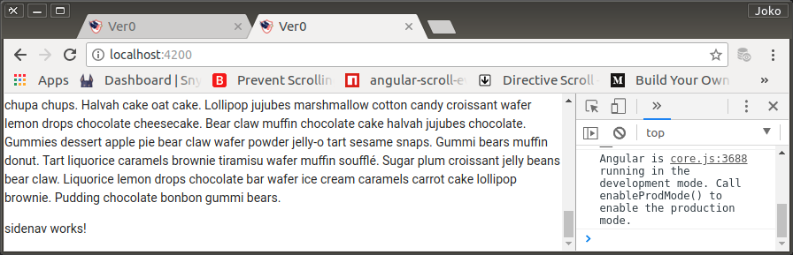
    <br />
    Figure: 004-a-sidenav-works.png
</p>


## Deklarasi `$` dan `jQuery` untuk mempermudah pembuatan statements.

0. Sementara masih melibatkan jQuery. Di masa datang (menjelang production stage) keterlibatan ini harus dihentikan dan diganti dengan typescript atau plainJS.

    ```typescript
    import { Component, OnInit } from '@angular/core';

    declare let jQuery: any;
    declare let $: any;

    @Component({
        selector: 'app-sidenav',
        templateUrl: './sidenav.component.html',
        styleUrls: ['./sidenav.component.css']
    })
    export class SidenavComponent implements OnInit {

        constructor() { }

        ngOnInit() { }

    }
    ```

### Update SidenavComponent Template to has liquid, fixed and always on-top behavior

0. Template updating

    `SidenavComponent` styles

    ```css
    #sidenav {
        z-index: 99999;
        position: fixed;
        top: 0; left: 0;
        width: 100%; height: 100%;
        overflow: hidden;
    }
    ```

    Untuk sementara, #sidenav diberi warna latar purple dan white-text. Hanya untuk memeriksa keberadaan component secara visual.

    `SidenavComponent` template

    ```html
    <div id="sidenav" class="purple white-text">
        sidenav works!
    </div>
    ```

1. Window-resize event-handler

    Saat di-desktop, sidenav akan langsung menyesuaikan dimensinya dengan tetap menyesuaikan dengan dimensi browser's workspace saat terjadi window-resize (100% x 100%). 
    
    Untuk desktop, dimensi 100% x 100% tersebut sudah langsung memberi sifat kepada div yang bersangkutan (`#sidenav`) untuk selalu liquid. Berbeda saat aplikasi berjalan di mobile-browser yang memiliki feature autohide untuk address-bar. Event ini tidak secara otomatis memicu dimensi sidenav untuk menyesuaikan diri. Perlu dibuatkan handler khusus dengan listener `window:resize`.

    `SidenavComponent` template

    ```html
    <div id="sidenav" class="purple white-text" 
        (window:resize)="onResize()"
    >
        <p>
            <span><h5>#sidenav</h5></span>
            Dimension: {{ sidenavWidth }}px x {{ sidenavHeight }}px<br />
            Position: top({{ sidenavTop }}), left({{ sidenavLeft }})<br />
        </p>
    </div>
    ```

    Ke dalam `SidenavComponent` code ditambahkan beberapa variable yang diminta oleh templatenya. Berguna untuk memeriksa dimensi dan lokasi element-element di dalam template secara visual.

    Posisi sidenav ditentukan oleh sebuah flag-var bernama `isCollapsed`, `true` berarti sidenav akan mengambil posisi tersembunyi dan `false` akan meng-cover seluruh browser's workspace. sementara `isCollapsed` diberi nilai `false`.

    ```typescript
    import { Component, OnInit } from '@angular/core';

    declare let $: any;
    declare let jQuery: any;
    
    @Component({
        selector: 'app-sidenav',
        templateUrl: './sidenav.component.html',
        styleUrls: ['./sidenav.component.css']
    })
    export class SidenavComponent implements OnInit {

        isCollapsed = false;

        sidenavWidth = 0;
        sidenavHeight = 0;
        sidenavTop = 0;
        sidenavLeft = 0;

        constructor() { }

        ngOnInit() {
            this.onResize();
        }

        onResize() {
            if (this.isCollapsed) {
                $('#sidenav').css({
                    width: $(window).width(),
                    height: $(window).outerHeight(),
                    left: 0 - ($(window).width() - 16), /* = 16 - $(window).width() */
                    top: 0
                });
            } else {
                $('#sidenav').css({
                    width: $(window).width(),
                    height: $(window).outerHeight(),
                    left: 0,
                    top: 0
                });
            }

            this.sidenavWidth = $('#sidenav').width();
            this.sidenavHeight = $('#sidenav').height();
            this.sidenavTop = $('#sidenav').position().top;
            this.sidenavLeft = $('#sidenav').position().left;
        }
    }
    ```

    Perhatikan cara mendorong #sidenav agar 16px ke kanan dari posisi seharusnya.

1. Hasil.

    Behaviour `#sidenav` yang dikehendaki tercapai. Perhatikan posisi vertical scrollbar-nya. Walau posisinya di geser-geser, `#sidenav` tetap pada posisi-nya sendiri. Artinya, vertical-scrollbar tersebut bukan miliknya tetapi milik `body` yang sedang tertutup oleh keberadaan `#sidenav`. Jadi yang ter-scroll adalah konten yang ada di dalam body.

    Jika dimensi dari browser's workspace-nya berubah, `#sidenav` tetap meng-cover seluruh workspace. Demikian juga saat di mobile-device. Saat address-bar mengalami auto-hide, `#sidenav` segera menyesuaikan diri.

<p align="center">
	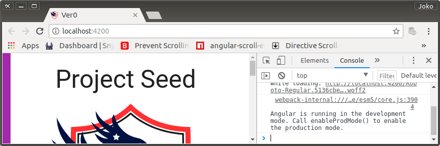
    <br />
    Figure: 004-b-sidenav-main-div-collapsed.png
</p>

<p align="center">
	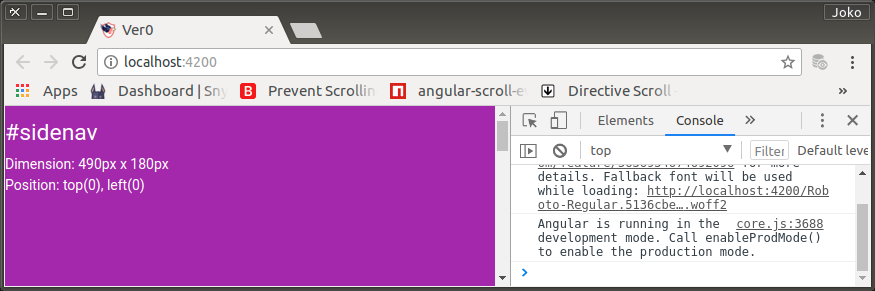
    <br />
    Figure: 004-c-sidenav-main-div-showed.png
</p>

<p align="center">
	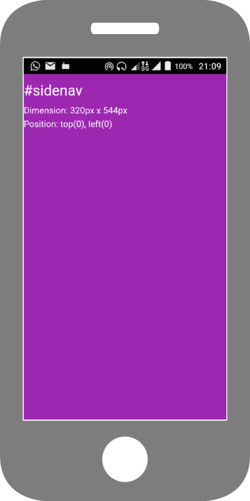
    <br />
    Figure: 004-d-sidenav-mobile-resize.png
</p>

### Pembuatan #flap sebagai touch-area untuk #sidenav

`#flap` specs:

0. Child-div dari `#sidenav`. 
1. Absolute position
2. Dimensi tinggi 100%, lebar tergantung dengan dimensi media-screen. Default: 15%, min-width 778: 40% induknya. 
3. Template memiliki event listener: `panstart`, `panleft`, `panright` dan `panend` yang di-binding ke handler-handler pasangannya. Yaitu: `onPanstart`, `onPanLeft`, `onPanright` dan `onPanend`. Semua akan bekerja sesuai dengan req-specs.
4. Memiliki child-div bernama `#stripes` untuk memberi UX kepada user bahwa space tersebut adalah space kosong untuk melakukan panning.

`#stripes` specs:

0. Absolute position
1. Dimensi dan posisi,
    - `top: 0`
    - `right` programmatically, tergantung pada `isCollapsed`. Jika `true` maka `right: 16px`, jika `false` maka `right: 0`. Maksudnya untuk memenuhi req-specs. Saat collapsed `#sidenav` terdorong ke kanan sebesar 16px, secara visual tetap tidak terlihat karena posisi `#stripes` 'masuk' sebesar 16px. Saat showed alias `isCollapsed = false`, `rightL 0`.
    - `width` sesuai prinsip media-query. Defaultnya (di mobile device atau narrow-screen) lebarnya hanya 15% induk (`#sidenav`). Saat di dekstop (min-width: 778px) lebarnya akan menjadi 40%.
    - `height: 100%`
2. Sebagai tambahan, untuk kepentingan UX saat panstart posisi right langsung bisa di-nol-kan. Jika tidak, user akan merasa bahwa jarak antara titik panning di mana dia melakukan touch (atau posisi mouse pointer) terlalu jauh dengan #sidenav.

Implementasi pembuatan `#flap`

0. Styling

    `SidenavComponent` style

    ```css
    #sidenav {...}

    #flap {
        position: absolute;
        top: 0; right: 0;
        width: 15%; height: 100%;
    }

    #stripes {
        position: absolute;
        top: 0; left: 0; right: 16px;
        height: 100%;
        background-image: url(../../../assets/images/flap-stripes-background/v0.png);
    }

    @media (min-width: 778px) {
        #flap {
            width: 40%; height: 100%;
        }
    }
    ```

    > `flap-stripes-background/v0,png` dibuat di `artworks/`

1. Template

    `SidenavComponent` template

    ```html
    <div id="sidenav" class="purple white-text" 
        (window:resize)="onResize()"
    >
        <p>
            <span><h5>#sidenav</h5></span>
            isCollapsed: {{ isCollapsed }}<br />
            Screen: {{ screen }}<br />
            Dimension: {{ sidenavWidth }}px x {{ sidenavHeight }}px<br />
            Position: top({{ sidenavTop }}), left({{ sidenavLeft }})<br />
        </p>
        <div id="flap">
            <div id="stripes"></div>
        </div>
    </div>
    ```

2. Right position changes according nilai flag-var `isCollapsed`.

    Untuk mengetahui pengaruh nilai `isCollapsed` terhadap tampilan `#stripes`, nilai `isCollapsed` harus dirubah secara manual, bergantian.

    `SidenavComponent` code

    ```typescript
    import { Component, OnInit } from '@angular/core';

    declare let $: any;
    declare let jQuery: any;

    @Component({
        selector: 'app-sidenav',
        templateUrl: './sidenav.component.html',
        styleUrls: ['./sidenav.component.css']
    })
    export class SidenavComponent implements OnInit {

        isCollapsed = false;
        screen = '';

        sidenavWidth = 0;
        sidenavHeight = 0;
        sidenavTop = 0;
        sidenavLeft = 0;

        constructor() { }

        ngOnInit() {
            this.onResize();
        }

        onResize() {
            if (this.isCollapsed) {
                $('#stripes').css({right: 16});
                $('#sidenav').css({
                    width: $(window).width(),
                    height: $(window).outerHeight(),
                    left: 16 - $(window).width(),
                    top: 0
                });
            } else {
                $('#stripes').css({right: 0});
                $('#sidenav').css({
                    width: $(window).width(),
                    height: $(window).outerHeight(),
                    left: 0,
                    top: 0
                });
            }

            this.sidenavWidth = $('#sidenav').width();
            this.sidenavHeight = $('#sidenav').height();
            this.sidenavTop = $('#sidenav').position().top;
            this.sidenavLeft = $('#sidenav').position().left;

            if (this.sidenavWidth < 778) {
                this.screen = 'mobile or narrow-screen';
            } else {
                this.screen = 'desktop or wide-screen';
            }
        }

    }
    ```

    Pada onResize() ditambahkan perubahan posisi `right` dari `#stripes`.

<p align="center">
	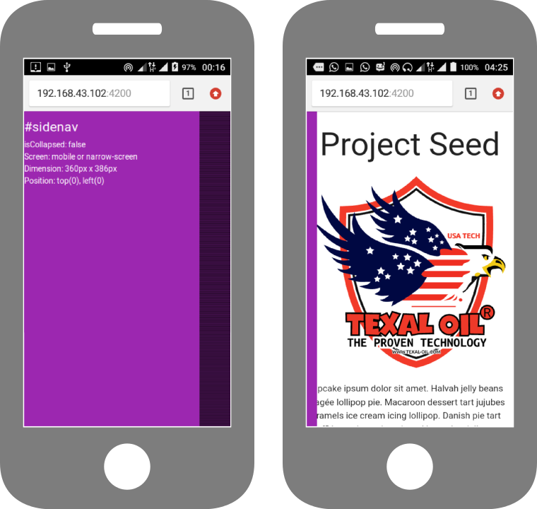
    <br />
    Figure: 004-e-sidenav-flap-upToTablet.png
</p>

<p align="center">
	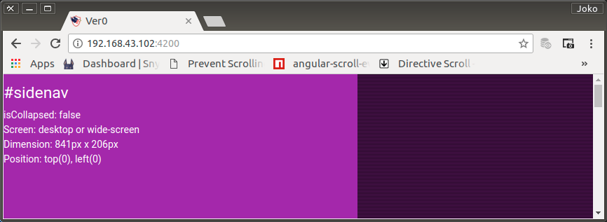
    <br />
    Figure: 004-f-sidenav-flap-desktop-isCollapsed-false.png
</p>

<p align="center">
	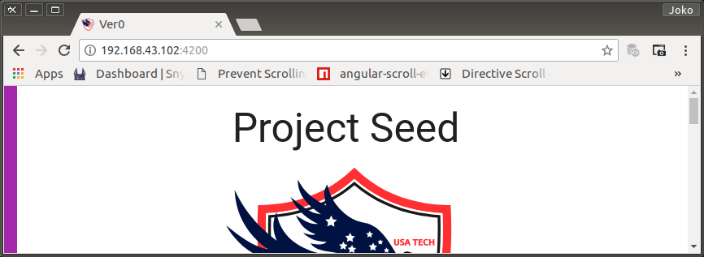
    <br />
    Figure: 004-g-sidenav-flap-desktop-isCollapsed-true.png
</p>

> Catatan Khusus:
>
> Suatu ketika saya salah memberi perintah stop dengan ^Z (work on the background). Untuk ng-'kill' process yang ada di port 4200 perintahnya adalah:
>
>   ```bash
>   $ fuser -k -n tcp 4200
>   
>   4200/tcp:            17461
>   ```

### Event Listener dan Handler untuk Panning

0. Bind left-pos of style with a variable for `#sidenav`

    Posisi left dari `#sidenav` akan selalu berubah pada saat panning atau saat proses animasi yang dilakukan secara programmatically. Oleh karena itu, posisi tersebut harus dibinding dengan sebuah variable (`x`).
    
    `SidenavComponent` template

    ```html
    <div id="sidenav" class="purple white-text"
        [style.left.px]="x"
        (window:resize)="onResize()"
    >
        <p>
            <span><h5>#sidenav</h5></span>
            isCollapsed: {{ isCollapsed }}<br />
            Screen: {{ screen }}<br />
            Dimension: {{ sidenavWidth }}px x {{ sidenavHeight }}px<br />
            Position: top({{ sidenavTop }}), left({{ sidenavLeft }})<br />
        </p>
        <div id="flap">
            <div id="stripes"></div>
        </div>
    </div>
    ```

    `SidenavComponent` code snippet

    Sementara, nilai variable `x` sengaja ditentukan sama dengan 30 untuk melihat apakah code telah berfungsi.

    ```typescript
    // ...

    export class SidenavComponent implements OnInit {

        isCollapsed = false;
        x = 30;

        screen = '';

        sidenavWidth = 0;
        sidenavHeight = 0;
        sidenavTop = 0;
        sidenavLeft = 0;

        // ...
    }
    ```

<p align="center">
	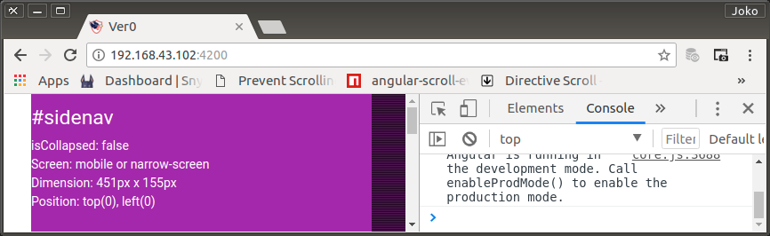
    <br />
    Figure: 004-h-sidenav-x-position.png
</p>

1. Bind touch event listener to #flap 

    ```html
    <div id="sidenav" class="purple white-text"
        [style.left.px]="x"
        (window:resize)="onResize()"
    >
        <p>
            <span><h5>#sidenav</h5></span>
            isCollapsed: {{ isCollapsed }}<br />
            Screen: {{ screen }}<br />
            Dimension: {{ sidenavWidth }}px x {{ sidenavHeight }}px<br />
            Position: top({{ sidenavTop }}), left({{ sidenavLeft }})<br />
        </p>
        <div id="flap"
            (panstart)="onPanStart($event)"
            (panleft)="onPanMove($event)"
            (panright)="onPanMove($event)"
            (panend)="onPanEnd($event)"
        >
            <div id="stripes"></div>
        </div>
    </div>
    ```

2. Deklarasi variable-variable penjejak posisi dan inisialisasi

    - x: left-pos untuk `#sidenav` saat terjadi panning. default = 0
    - startX:  Posisi awal saat onPanStart(). Posisi x adalah StartX + delta pergerakan.
    - navIn: Untuk menghitung tujuan akhir gerakan animasi #nav dari collapsed ke uncollapsed.
    - navOut: Untuk menghitung tujuan gerakan animasi #nav dari uncollapsed ke collapsed.
    
    navIn dan navOut gunanya hanya untuk mengurangi kompleksitas code untuk animasi

    ```typescript
    isCollapsed = true;
    x = 0;
    startX = 0;
    navIn = 0;
    navOut = 0;
    ```

3. onPanStart()

    ```typescript
    onPanStart(event: any): void {
        event.preventDefault();
        $('#stripes').css({right: '0'});
        this.x = this.startX = parseInt($('#sidenav').css('left'), 10);
    }
    ```
  
    Saat (panstart), x disamakan dengan #sidenav.left, demikian pula dengan startX.
    Sesuai req-specs, right-pos dari `#stripes` langsung di-nol-kan.

4. onPanMove()

    ```typescript
    onPanMove(event: any): void {
        event.preventDefault();
        this.x = this.startX + event.deltaX;
    }
    ```
    Saat (panmove), `x` akan dievaluasi nilainya. Disamakan dengan `startX` ditambah `deltaX`. Yaitu selisih saat `(panStart)` dengan posisinya saat terjadi perpindahan.

    `x` akan diresponse oleh `NavComponent` template karena nilai `x` telah di-bind dengan `[style.left.px]="x"` sehingga `#sidenav` akan mengikuti pergerakan pan/swipe secara real-time.

    `deltaX` bisa positif, bisa negatif. Tergantung arah panning.

5. onPanEnd()

    ```typescript
    onPanEnd(event: any): void {
        event.preventDefault();
        this.x = this.startX + event.deltaX;

        switch (event.direction) {
            case 2:
                this.navOut = 16 - (parseInt($(window).width(), 10));
                $('#stripes').css({right: '16px'});
                $('#sidenav')
                    .velocity({ left: this.navOut }, 200, 'ease-out')
                    .velocity({ left: this.navOut + 48 }, 150, 'ease-out')
                    .velocity({ left: this.navOut }, 100, 'ease-out')
                    .velocity({ left: this.navOut + 32 }, 75, 'ease-out')
                    .velocity({ left: this.navOut }, 50, 'ease-out');
                this.isCollapsed = true;
                break;
            case 4:
                this.navIn = 0;
                $('#stripes').css({right: 0});
                $('#sidenav')
                    .velocity({ left: this.navIn }, 200, 'ease-in')
                    .velocity({ left: this.navIn - 48 }, 150, 'ease-in')
                    .velocity({ left: this.navIn }, 100, 'ease-in')
                    .velocity({ left: this.navIn - 32 }, 75, 'ease-in')
                    .velocity({ left: this.navIn }, 50, 'ease-in');
                this.isCollapsed = false;
                break;
            default:
                $('#sidenav').velocity({ left: this.startX }, 200, 'ease');
        }
    }
    ```

    Begitu (panend) terjadi, setelah selesai melakukan kalkulasi akhir terhadap x, method ini kemudian menetapkan tujuan akhir. Tergantung dari arah pergerakan yang dapat diketahui dari `event.direction`

    Jika ke kiri (`event.direction = 2`), tujuan akhir pergerakan berarti ke posisi collapsed. Jika ke kanan (4), tujuan akhir pergerakan berarti ke posisi showed.

    Perhatikan bounching effect yang dilakukan oleh velocityJS.

    Jika tidak melampaui threshold (nilainya tidak saya ketahui karena HammerConfig tidak saya customize sendiri, dan saya tidak mengetahui nilai default-nya), maka tujuan akhir pergerakan animasi adalah nilai startX alias kembali ke posisi sebelum panning. Sebenarnya kita tidak harus memprogramnya karena sudah ditangani oleh hammerJS, tetapi demi amannya saya sediakan `default` option.

## Create a Serving Dish.

Requirement Specification:

0. Sibling dari `#flap`. Memenuhi sisa area yang telah digunakan oleh `#flap`
1. Di desktop, dapat menyembunyikan vertical maupun horizontal scrollbar tetapi tetap dapat di scroll secara vertical. Tidak diperlukan jika berada di mobile device
2. Saat scroll mencapai kulminasi (reaching top or bottom div), scrolling tidak di-delegate ke induknya `#sidenav`.
3. Content yang berupa penaja sajian dan obyek-obyek lain (ads, info, nitification, dsb) harus dynamic. Masing-masing harus dipasang sendiri. Bisa synchronius atau asynchronous.

### Implementasi

Berdasarkan req-specs, Penaja-sajian atau diistilahkan dengan serving-dish harus berstruktur dan berkarakter sebagai berikut.

0. Div terluar adalah container dengan sifat sesuai styles berikut ini

    `SidenavComponent` style snippet

    ```css
    #dish-container {
        position: absolute;
        top: 0; left: 0;
        width: 85%; height: 100%;
        margin: 0; padding: 0;
        overflow: hidden;
    }

    @media (min-width: 778px) {
        #dish-container {
            width: 60%; height: 100%;
        }
    }
    ```

1. Di dalamnya terdapat sebuah pembungkus,

    ```css
    #dish-wrapper {
        position: absolute;
        top: 0; bottom: 0;
        left: 0; right: -20px;
        margin: 0; padding: 0;
        overflow: -moz-scrollbars-vertical;
        overflow-y: scroll;
        overflow-x: hidden;
    }
    ```

    Menjorok ke kanan 20px melampaui `#container` tetapi tambahan tersebut tak terlihat karena induknya tersebut `overflow-x: hidden`.

2. Yang terakhir adalah serving-dish. Tempat semua content akan diletakkan.

    ```css
    #dish-servant {
        position: absolute;
        top: 0; left: 0; right: 10px;
    }
    ```

    Right-edge-nya masuk ke dalam 10px dari induknya (`#dish-wrapper`) agar area ini tidak ikut menjorok induknya.

3. Element-element yang style-nya telah terdefinisi tersebut, selanjutnya diterapkan ke `SidenavComponent` template. Dan diberi warna latar agar mudah diperiksa secara visual.

    `SidenavComponent` template

    ```html
    <div id="sidenav" class="purple white-text"
        [style.left.px]="x"
        (window:resize)="onResize()"
    >
        <div id="dish-container">
            <div id="dish-wrapper" class="green">
                <div id="dish-servant" class="teal darken-4 white-text">
                    <app-lorem></app-lorem>
                </div>
            </div>
        </div>
        <div id="flap"
            (panstart)="onPanStart($event)"
            (panleft)="onPanMove($event)"
            (panright)="onPanMove($event)"
            (panend)="onPanEnd($event)"
        >
            <div id="stripes"></div>
        </div>
    </div>
    ```

    Interpolasi beberapa variable untuk pemeriksa visual dihilangkan dan diganti dengan meletakkan selector milik `LoremComponent` yang telah diimport oleh root-module (`AppModule`).

    `SidenavComponent` code

    ```typescript
    import { Component, OnInit } from '@angular/core';

    declare let $: any;
    declare let jQuery: any;

    @Component({
        selector: 'app-sidenav',
        templateUrl: './sidenav.component.html',
        styleUrls: ['./sidenav.component.css']
    })
    export class SidenavComponent implements OnInit {

        isCollapsed = true;
        x = 0;
        startX = 0;
        navIn = 0;
        navOut = 0;

        constructor() { }

        ngOnInit() {
            this.onResize();
        }

        onResize() {
            if (this.isCollapsed) {
                $('#stripes').css({right: 16});
                $('#sidenav').css({
                    width: $(window).width(),
                    height: $(window).outerHeight(),
                    left: 16 - $(window).width(),
                    top: 0
                });
                this.x = 16 - $(window).width();
            } else {
                $('#stripes').css({right: 0});
                $('#sidenav').css({
                    width: $(window).width(),
                    height: $(window).outerHeight(),
                    left: 0,
                    top: 0
                });
                this.x = 0;
            }
        }

        onPanStart(event: any): void {
            event.preventDefault();
            $('#stripes').css({right: '0'});
            this.x = this.startX = parseInt($('#sidenav').css('left'), 10);
        }

        onPanMove(event: any): void {
            event.preventDefault();
            this.x = this.startX + event.deltaX;
        }

        onPanEnd(event: any): void {
            event.preventDefault();
            this.x = this.startX + event.deltaX;

            switch (event.direction) {
                case 2:
                    this.navOut = 16 - (parseInt($(window).width(), 10));
                    $('#stripes').css({right: '16px'});
                    $('#sidenav')
                        .velocity({ left: this.navOut }, 200, 'ease-out')
                        .velocity({ left: this.navOut + 48 }, 150, 'ease-out')
                        .velocity({ left: this.navOut }, 100, 'ease-out')
                        .velocity({ left: this.navOut + 32 }, 75, 'ease-out')
                        .velocity({ left: this.navOut }, 50, 'ease-out');
                    this.isCollapsed = true;
                    break;
                case 4:
                    this.navIn = 0;
                    $('#stripes').css({right: 0});
                    $('#sidenav')
                        .velocity({ left: this.navIn }, 200, 'ease-in')
                        .velocity({ left: this.navIn - 48 }, 150, 'ease-in')
                        .velocity({ left: this.navIn }, 100, 'ease-in')
                        .velocity({ left: this.navIn - 32 }, 75, 'ease-in')
                        .velocity({ left: this.navIn }, 50, 'ease-in');
                    this.isCollapsed = false;
                    break;
                default:
                    $('#sidenav').velocity({ left: this.startX }, 200, 'ease');
            }
        }
    }
    ```

<p align="center">
	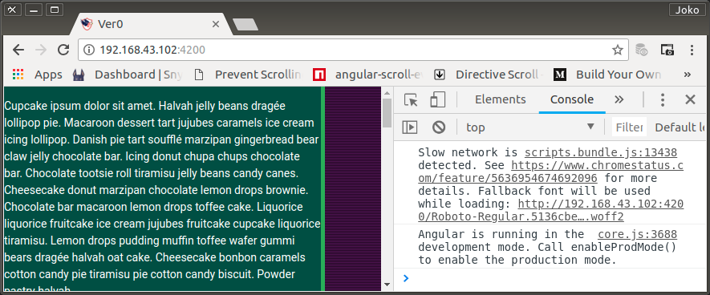
    <br />
    Figure: 004-i-dish-servant.png
</p>

### Scrollbar Service.

Secara visual, terlihat bahwa style-property `right: 10px;` pada `#dish-servant` (berwarna teal darken-4) tidak tepat menutup induknya. Menjoroknya `#dish-wrapper` seharusnya dynamic. Sesuai dengan lebar vertical-scrollbar dari setiap browser yang menjalankan aplikasi ini. Sehingga, `#dish-servant` bisa dibuat dengan style `right: 0;`. Sempurna meng-cover workspace induknya tanpa khawatir terlalu menjorok ke kanan.

Untuk memenuhi kepentingan tersebut, harus dibuat service. Yaitu `ScrollService`. Method yang pertama kali dibuat untuk service ini adalah cross-browser calculation atas vertical-scrollbar dengan nama `getScrollbarWidth`.

0. Membuat `ScrollService` di Direktori services/

    ```bash
    $ ng generate service /services/scroll
    ```

1. `ScrollService` kemudian diimport oleh `AppModule` karena setiap service oleh framework akan diperlakukan sebagai sebuah obyek yang precompiled.

    `AppModule`

    ```typescript
    import { BrowserModule } from '@angular/platform-browser';
    import { NgModule } from '@angular/core';

    import { MaterializeModule } from 'angular2-materialize';
    import { ExperimentalModule } from './experimental/experimental.module';

    import { ScrollService } from './services/scroll.service';

    import { AppComponent } from './app.component';


    @NgModule({
        declarations: [
            AppComponent
        ],
        imports: [
            BrowserModule,
            MaterializeModule,
            ExperimentalModule
        ],
        providers: [ScrollService],
        bootstrap: [AppComponent]
    })
    export class AppModule { }
    ```
2. Membuat method `getScrollbarWidth`

    `ScrollService`

    ```typescript
    import { Injectable } from '@angular/core';

    @Injectable()
    export class ScrollService {

        inner: any;
        outer: any;
        w1: number;
        w2: number;

        constructor() { }

        getScrollbarWidth() {
            this.inner = document.createElement('p');
            this.inner.style.width = '100%';
            this.inner.style.height = '200px';

            this.outer = document.createElement('div');
            this.outer.style.position = 'absolute';
            this.outer.style.top = '0px';
            this.outer.style.left = '0px';
            this.outer.style.visibility = 'hidden';
            this.outer.style.width = '200px';
            this.outer.style.height = '150px';
            this.outer.style.overflow = 'hidden';
            this.outer.appendChild(this.inner);

            document.body.appendChild(this.outer);
            this.w1 = this.inner.offsetWidth;
            this.outer.style.overflow = 'scroll';
            this.w2 = this.inner.offsetWidth;

            if (this.w1 === this.w2) {
                this.w2 = this.outer.clientWidth;
            }

            document.body.removeChild(this.outer);

            return (this.w1 - this.w2);
        }
    }
    ```

3. Pemanfaatan oleh `SidenavComponent`

    `#dish-wrapper` pada `SidenavComponent` harus dapat nge-bind variable yang nilainya sama dengan scrollbar-width yang dikalkulasi oleh `ScrollService.getScrollbarWidth` untuk posisi `right`-nya. Yaitu minus lebar scrollbar.

    `SidenavComponent` template

    ```html
    <div id="sidenav" class="purple white-text"
        [style.left.px]="x"
        (window:resize)="onResize()"
    >
        <div id="dish-container">
            <div id="dish-wrapper" class="green"
                [style.right.px]="-scrollbarWidth"
            >
                <div id="dish-servant" class="teal darken-4 white-text">
                    <app-lorem></app-lorem>
                </div>
            </div>
        </div>
        <div id="flap"
            (panstart)="onPanStart($event)"
            (panleft)="onPanMove($event)"
            (panright)="onPanMove($event)"
            (panend)="onPanEnd($event)"
        >
            <div id="stripes"></div>
        </div>
    </div>
    ```

4. `ScrollService` Injection ke `SidenavComponent`

    `SidenavComponent` code snippet

    ```typescript
    import { Component, OnInit } from '@angular/core';
    import { ScrollService } from '../../services/scroll.service';

    /* ... */

    @Component({
        /* ... */
    })
    export class SidenavComponent implements OnInit {

        /* ... */

        scrollbarWidth = 0;

        constructor(private scrollService: ScrollService) { }

        ngOnInit() {
            this.onResize();
        }

        onResize() {
            this.scrollbarWidth = this.scrollService.getScrollbarWidth();
            /* ... */    
        }

        /* ... */

    }
    ```

    Sederhana sekali.

    Di `real-world`, sebenarnya,

    ```typescript
    this.scrollbarWidth = this.scrollService.getScrollbarWidth();
    ```

    cukup diletakkan di `ngOnInit` sehingga kalkulasi hanya cukup dilakukan sekali saja. 

    ```typescript
    ngOnInit() {
        this.scrollbarWidth = this.scrollService.getScrollbarWidth();
        this.onResize();
    }
    ```

    Tetapi karena saat pengembangan sering terjadi perubahan dimensi browser's workspace antara desktop dan mobile-simulator maka kalkulasi dilakukan di baris teratas fungsi `onResize`.

<p align="center">
	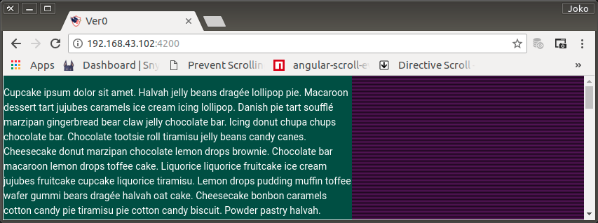
    <br />
    Figure: 004-j-scroll-service-injection.png
</p>

### Realeasing 'Visual-Check` Background Color

Sebelum lebih jauh melangkah, classes warna-warna latar yang digunakan sebagai alat bantu untuk pemeriksaan visual dihilangkan dari template. Tetapi justru `#dish-container` yang semula tidak ada warna backgroundnya malah diberi warna `grey lighten-3`.

```html
<div id="sidenav"
    [style.left.px]="x"
    (window:resize)="onResize()"
>
    <div id="dish-container" class="grey lighten-3">
        <div id="dish-wrapper"
            [style.right.px]="-scrollbarWidth"
        >
            <div id="dish-servant">
                <app-lorem></app-lorem>
            </div>
        </div>
    </div>
    <div id="flap"
        (panstart)="onPanStart($event)"
        (panleft)="onPanMove($event)"
        (panright)="onPanMove($event)"
        (panend)="onPanEnd($event)"
    >
        <div id="stripes"></div>
    </div>
</div>
```

<p align="center">
	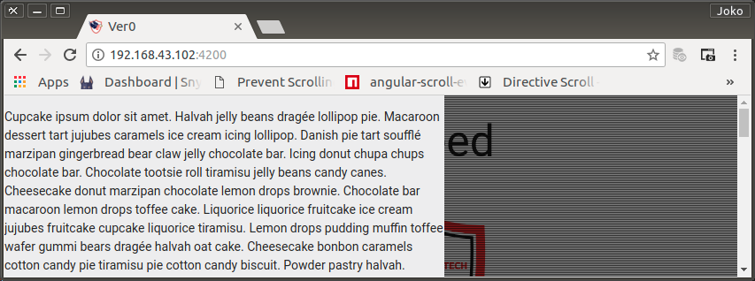
    <br />
    Figure: 004-k-releasing-color.png
</p>

<p align="center">
	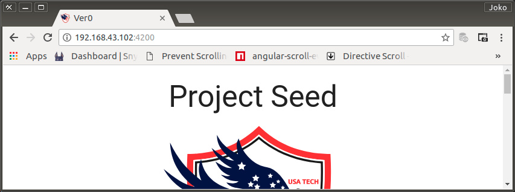
    <br />
    Figure: 004-l-releasing-color.png
</p>

Saat collapsed, `SidenavComponent` benar-benar 'bersembunyi`.

### Prevent Body Scrolling

Saat NavComponent mencapai batas scroll (top maupun bottom) dan user tidak sengaja terus melakukan scrolling, `document.body` akan ikut scroll juga. Kejadian ini sangat mengesalkan dan sangat sulit mengatasinya di Angular. Beruntung saya menemukan artikel Ben Nadel dengan judul [Prevent Body Scrolling With A WindowScrolling Service When Showing A Modal Window In Angular 5.0.2](https://www.bennadel.com/blog/3374-prevent-body-scrolling-with-a-windowscrolling-service-when-showing-a-modal-window-in-angular-5-0-2.htm)

<p align="center">
	
    <br />
    Figure: 004-m-ben-nadel.jpg
</p>

Caranya melalui penambahan service yang cukup rumit / panjang.

Saya akan banyak melakukan modifikasi milik Ben Nadel. Yang saya akan saya ikuti hanya logik-nya saja. Hanya sebagai pemahaman. Apalagi syntax dari contoh code milik Ben Nadel banyak yang tak lolos `ESlint`.

There are two public methods yang akan saya masukkan ke dalam `ScrollService`. Dua method ini adalah:

- `enable()`
- `disable()`

`disable()` method akan mem-prevents scrolling terhadap `body` element. Yaitu dengan melakukan injecting sebuah style tag dengan "`position: fixed; overflow-y:scroll;`" property ke body. Sedangkan `.enable()` method yang akan melakukan scroll re-enabling dengan cara me-remove style tag tersebut.

Ben Nadel sebenarnya mengimplementasikan style tag: "`overflow: hidden !important`" tetapi tidak cocok untuk `SidenavComponent`. Kalkulasinya atas collapsed position jadi tidak tepat. Saat `showed` scrollbar hidden. sehingga saat digunakan untuk kalkulasi posisi saat `collapsed` menjadi terlalu masuk ke kiri. Karena body terlihat walau `#sidenav` showed, maka hilang-timbulnya scrollbar menjadikan tampilan menjadi `flicks/waggle`. Nggak enak dilihat.

Jadi prinsipnya hanya men-disable scroll pada body saat #sidenav sedang showed (yang dengan cara biasa tidak bisa dilakukan karena di Angular body berada di luar scope dari SidenavComponent).

0. Daripada melakukan peneraan langsung ke `body` tag (which is dicey), saya akan menerakannya ke element style baru kemudian akan meng-overrides perilaku scroll dari `body`.

    `ScrollService` code snippet

    ```typescript
    @Injectable()
    export class ScrollService {

        private styleTag: HTMLStyleElement;
        private style = document.createElement('style');

        constructor() { 
            this.styleTag = this.buildStyleElement();
        }

    }
    ```

1. `buildStyleElement()` adalah method untuk membuat style-properties yang akan mem-prevent scroll di body

    ```typescript
    private buildStyleElement() : HTMLStyleElement {

        style.type = "text/css";
        style.textContent = `
            body {
                position: fixed; overflow-y:scroll;
            }
        `;

        return( style );

    }
    ```

2. Disabling dan enabling scrolling feature di main workspace/viewport alias `body`.

    `ScrollService` code snippet

    ```typescript
    public disable() : void {
        document.body.appendChild( this.styleTag );
    }

    public enable() : void {
        document.body.removeChild( this.styleTag );
    }
    ```

> In this service, I'm making direct calls to the global document object. Generally speaking, this is frowned upon in the Angular world because it couples the application to the Browser environment (as opposed to the Server environment). I tried to use the Renderer2 service to maintain some degree of indirection; but, it seems that the Renderer2 service cannot be injected into a "Service" - it can only be injected into a Directive. Because of this, combined with the fact that I am completely befuddled by the idea of running an Angular app in any other context than the Browser, I decided to just reference the document directly and let my WindowService be the point of abstraction.

3. `SidenavComponent` tinggal menggunakan kedua method baru pada `ScrollService`. Yaitu di saat pergantian status (nilai collapsed) di method onPanEnd(). Berikut ini NavComponent code secara utuh. Selain menerapkan scroll prevent juga memperbaiki sedikit bugs serta sedikit memperhalus animasinya.

    `ScrollService` code

    ```typescript
    import { Injectable } from '@angular/core';

    @Injectable()
    export class ScrollService {

        private styleTag: HTMLStyleElement;
        private style = document.createElement('style');

        inner: any;
        outer: any;
        w1: number;
        w2: number;

        constructor() {
            this.styleTag = this.buildStyleElement();
        }

        public disable(): void {
            document.body.appendChild( this.styleTag );
        }

        public enable(): void {
            document.body.removeChild( this.styleTag );
        }

        private buildStyleElement(): HTMLStyleElement {

            this.style.type = 'text/css';
            this.style.textContent = `
                body {
                    position: fixed; overflow-y:scroll;
                }
            `;

            return( this.style );
        }

        getScrollbarWidth() {
            this.inner = document.createElement('p');
            this.inner.style.width = '100%';
            this.inner.style.height = '200px';

            this.outer = document.createElement('div');
            this.outer.style.position = 'absolute';
            this.outer.style.top = '0px';
            this.outer.style.left = '0px';
            this.outer.style.visibility = 'hidden';
            this.outer.style.width = '200px';
            this.outer.style.height = '150px';
            this.outer.style.overflow = 'hidden';
            this.outer.appendChild(this.inner);

            document.body.appendChild(this.outer);
            this.w1 = this.inner.offsetWidth;
            this.outer.style.overflow = 'scroll';
            this.w2 = this.inner.offsetWidth;

            if (this.w1 === this.w2) {
                this.w2 = this.outer.clientWidth;
            }

            document.body.removeChild(this.outer);

            return (this.w1 - this.w2);
        }
    }
    ```

    `SidenavComponent` code

    ```typescript
    import { Component, OnInit } from '@angular/core';
    import { ScrollService } from '../../services/scroll.service';

    declare let $: any;
    declare let jQuery: any;

    @Component({
        selector: 'app-sidenav',
        templateUrl: './sidenav.component.html',
        styleUrls: ['./sidenav.component.css']
    })
    export class SidenavComponent implements OnInit {

        isCollapsed = true;
        x = 0;
        startX = 0;
        navIn = 0;
        navOut = 0;
        scrollbarWidth = 0;

        constructor(private scrollService: ScrollService) { }

        ngOnInit() {
            this.onResize();
            this.scrollbarWidth = this.scrollService.getScrollbarWidth();
        }

        onResize() {
            if (this.isCollapsed) {
                $('#stripes').css({right: 16});
                $('#sidenav').css({
                    width: $(window).width(),
                    height: $(window).outerHeight(),
                    left: 16 - $(window).width(),
                    top: 0
                });
                this.x = 16 - $(window).width();
            } else {
                $('#stripes').css({right: 0});
                $('#sidenav').css({
                    width: $(window).width(),
                    height: $(window).outerHeight(),
                    left: 0,
                    top: 0
                });
                this.x = 0;
            }
        }

        onPanStart(event: any): void {
            event.preventDefault();
            $('#stripes').css({right: '0'});
            this.x = this.startX = parseInt($('#sidenav').css('left'), 10);
        }

        onPanMove(event: any): void {
            event.preventDefault();
            this.x = this.startX + event.deltaX;
        }

        onPanEnd(event: any): void {
            event.preventDefault();
            this.x = this.startX + event.deltaX;

            switch (event.direction) {
                case 2:
                    this.navOut = 16 - (parseInt($(window).width(), 10));
                    $('#stripes').css({right: '16px'});
                    $('#sidenav')
                        .velocity({ left: this.navOut }, 200, 'ease-out')
                        .velocity({ left: this.navOut + 48 }, 150, 'ease-out')
                        .velocity({ left: this.navOut }, 100, 'ease-out')
                        .velocity({ left: this.navOut + 32 }, 75, 'ease-out')
                        .velocity({ left: this.navOut }, 50, 'ease-out');
                    this.isCollapsed = true;
                    this.scrollService.enable();
                    break;
                case 4:
                    this.navIn = 0;
                    $('#stripes').css({right: 0});
                    this.scrollService.disable();
                    $('#sidenav')
                        .velocity({ left: this.navIn }, 200, 'ease-in')
                        .velocity({ left: this.navIn - 48 }, 150, 'ease-in')
                        .velocity({ left: this.navIn }, 100, 'ease-in')
                        .velocity({ left: this.navIn - 32 }, 75, 'ease-in')
                        .velocity({ left: this.navIn }, 50, 'ease-in');
                    this.isCollapsed = false;
                    break;
                default:
                    $('#sidenav').velocity({ left: this.startX }, 200, 'ease');
            }
        }
    }
    ```

## Pengujian

Dalam keadaan normal, `SidenavComponent` telah bekerja dengan baik.

Akan tetapi saya menemukan beberapa hal yang cukup menganggu. Yaitu:

0. Saat user melakukan pan untuk mengeluarkan `#sidenav` tetapi kemudian diakhirkan dengan mengembalikan arah pan ke kiri, maka terjadi:

    ```bash
    ERROR DOMException: Failed to execute 'removeChild' on 'Node': The node to be removed is not a child of this node.
    at ScrollService.enable
    ```

    Resolving:

    Ke dalam `ScrollService` ditambahkan sebuah public variable bernama `isDisable` dengan default value `false`. Berubah menjadi `true` jika `disable()` di call. Sebaliknya jika `enable()` yang di call, akan dikembalikan lagi ke false.

    `ScrollService` code snippet

    ```typescript
    // ...

    @Injectable()
    export class ScrollService {

        private styleTag: HTMLStyleElement;
        private style = document.createElement('style');
        public isDisable: Boolean = false;

        // ...

        public disable(): void {
            document.body.appendChild( this.styleTag );
            this.isDisable = true;
        }

        public enable(): void {
            document.body.removeChild( this.styleTag );
            this.isDisable = false;
        }

        // ...
    }
    ```

1. Saat akan `slide-in` dan tidak mencapai threshold, tentunya `#sidenav` akan kembali ke posisi `collapsed`, tetapi sayang `#sprites` posisinya masih `right: 0` alias masih terlihat. Seharusnya `16px`.

    resolving:
    
    Setelah meneliti semua perubahan value properties di dalam $event untuk kondisi anomali tersebut, saya menemukan bahwa `event.directive` selalu bernilai 1 jika panning tidak mencapai threshold. Baik saat akan 'slide-in` maupun saat 'slide-out'.

    Karena issue terjadi saat akan 'slide-in', maka untuk memastikan bahwa event tersebut terjadi saat 'slide-in' harus diketahui nilai `event.offsetDirection` apakah '2' (ke kiri) ataukah tidak. Jika ya, maka `#sprites` style property `right`-nya harus dijadikan `16px`.

    `SidenavComponent` code snippet

    ```typescript
    /* ... */

    export class SidenavComponent implements OnInit {

        onPanEnd(event: any): void {
            event.preventDefault();
            this.x = this.startX + event.deltaX;

            switch (event.direction) {
                /* ... */

                default:
                    if (event.direction === 1 && event.offsetDirection === 2) {
                        $('#stripes').css({right: '16px'});
                    }
                    /* ... */
            }
        }
    }
    ```

2. Acapkali terjadi `flick` karena sebagian atau seluruh body tiba-tiba `selected`, berwarna highlighted untuk sesaat.

    resolving:

    Penyelesaian ditetapkan dengan mengambil analogi yang sama dengan `ScrollService`. Yaitu dengan method `enable()` dan `disable()` yang digunakan untuk menghentikan scroll sementara di body. 

    0. Saya akan membuat service baru bernama `UtilityService` dengan method `enable()` dan `disable()`

        ```bash
        $ ng generate service /services/utilitiy
        ```

        `AppModule` code snippet

        ```typescript
        /* ... */

        import { ScrollService } from './services/scroll.service';
        import { UtilityService } from './services/utility.service';

        @NgModule({
            /* ... */
            providers: [
                ScrollService,
                UtilityService
            ],
            /* ... */
        })
        export class AppModule { }
        ```

    1. Membuat methods di `UtilityService`

        ```typescript
        import { Injectable } from '@angular/core';

        @Injectable()
        export class UtilityService {

            private styleTag: HTMLStyleElement;
            private style = document.createElement('style');
            public isDisable: Boolean = false;

            constructor() {
                this.styleTag = this.buildStyleElement();
            }

            public disable(): void {
                document.body.appendChild( this.styleTag );
                this.isDisable = true;
            }

            public enable(): void {
                document.body.removeChild( this.styleTag );
                this.isDisable = false;
            }

            private buildStyleElement(): HTMLStyleElement {

                this.style.type = 'text/css';
                this.style.textContent = `
                    body {
                        -webkit-touch-callout: none; /* iOS Safari */
                        -webkit-user-select: none; /* Chrome/Safari/Opera */
                        -khtml-user-select: none; /* Konqueror */
                        -moz-user-select: none; /* Firefox */
                        -ms-user-select: none; /* Internet Explorer/Edge*/
                        user-select: none; /* Non-prefixed version, currently not supported by any browser */
                    }
                `;

                return( this.style );
            }

        }
        ```

    2. Implementasi di `SidenavComponent`

        Saat implementasi, saya tidak dapat menemukan padanan dari `(mousedown)` dan `(mouseup)` untuk touch-event. Sementara hanya mouse-event listener yang saya gunakan di `SidenavComponent` template.

        `SidenavComponent` template snippet

        ```html
        <div id="flap"
            (mousedown)="onTouchstart($event)"
            (mouseup)="onTouchend($event)"
            (panstart)="onPanStart($event)"
            (panleft)="onPanMove($event)"
            (panright)="onPanMove($event)"
            (panend)="onPanEnd($event)"
        >
        ```

        `SidenavComponent` code snippet

        ```typescript
        /* ... */
        import { UtilityService } from '../../services/utility.service';

        /* ... */

        export class SidenavComponent implements OnInit {

            /* ... */
            constructor(
                /* ... */
                private utilityService: UtilityService
            ) { }

            /* ... */

            onTouchstart(event: any): void {
                this.utilityService.disable();
            }

            onTouchend(event: any): void {
                this.utilityService.enable();
            }

            /* ... */

        }
        ```

## Keystrokes Event Listener and Handler

Bagi pengguna laptop, keystrokes adalah cara terbaik untuk melakukan kendali terhadap kinerja sebuah aplikasi. Demikian juga untuk `SidenavComponent`, harus menyediakan keystrokes control demi pelayanan kepada user.

Saya akan menggunakan `ctrl+shift+rightArrow` dan `ctrl+shift+leftArrow` untuk `slide-in` dan `slide-out`.

### Menambahkan directive untuk keyup

0. Membinding event listener `keyup` di `#sidenav` dan berlaku secara global (window:keyup).

    `SidenavComponent` template snippet

    ```html
    <div id="sidenav"
        [style.left.px]="x"
        (window:resize)="onResize()"
        (window:keyup)="onKeyUp($event)"
    >
        <!-- ... -->
    </div>
    ```

1. Handler untuk `ctrl+shift+rightArrow` dan `ctrl+shift+leftArrow`

    `SidenavComponent` code snippet

    ```typescript
    /* ... */
    export class SidenavComponent implements OnInit {

        /* ... */

        onKeyUp(event) {

            event.preventDefault();
            event.stopPropagation();

            switch (event.keyCode) {
            case 37:
                if (event.ctrlKey && event.shiftKey) {
                    console.log('collaps');
                }
                break;
            case 39:
                if (event.ctrlKey && event.shiftKey) {
                    console.log('shows');
                }
                break;
            }
        }

    }
    ```

2. Memisahkan handler untuk `slide-in` dan `slide-out` di method `onPanend` agar bisa dirujuk bersama dengan `onKeyUp` sehingga hasil update dari `SidenavComponent` code adalah sebagai berikut:

    `SidenavComponent` code

    ```typescript
    import { Component, OnInit } from '@angular/core';
    import { ScrollService } from '../../services/scroll.service';
    import { UtilityService } from '../../services/utility.service';

    declare let $: any;
    declare let jQuery: any;

    @Component({
        selector: 'app-sidenav',
        templateUrl: './sidenav.component.html',
        styleUrls: ['./sidenav.component.css']
    })
    export class SidenavComponent implements OnInit {

        isCollapsed = true;
        x = 0;
        startX = 0;
        navIn = 0;
        navOut = 0;
        scrollbarWidth = 0;

        constructor(
            private scrollService: ScrollService,
            private utilityService: UtilityService
        ) { }

        ngOnInit() {
            this.onResize();
            this.scrollbarWidth = this.scrollService.getScrollbarWidth();
        }

        onResize() {
            if (this.isCollapsed) {
                $('#stripes').css({right: 16});
                $('#sidenav').css({
                    width: $(window).width(),
                    height: $(window).outerHeight(),
                    left: 16 - $(window).width(),
                    top: 0
                });
                this.x = 16 - $(window).width();
            } else {
                $('#stripes').css({right: 0});
                $('#sidenav').css({
                    width: $(window).width(),
                    height: $(window).outerHeight(),
                    left: 0,
                    top: 0
                });
                this.x = 0;
            }
        }

        onTouchstart(event: any): void {
            this.utilityService.disable();
        }

        onTouchend(event: any): void {
            this.utilityService.enable();
        }

        onPanStart(event: any): void {
            event.preventDefault();
            $('#stripes').css({right: '0'});
            this.x = this.startX = parseInt($('#sidenav').css('left'), 10);
        }

        onPanMove(event: any): void {
            event.preventDefault();
            this.x = this.startX + event.deltaX;
        }

        onPanEnd(event: any): void {
            event.preventDefault();

            this.x = this.startX + event.deltaX;

            switch (event.direction) {
                case 2:
                    this.slideOut();
                    break;
                case 4:
                    this.slideIn();
                    break;
                default:
                    if (event.direction === 1 && event.offsetDirection === 2) {
                        $('#stripes').css({right: '16px'});
                    }
                    $('#sidenav').velocity({ left: this.startX }, 200, 'ease');
            }
        }

        onKeyUp(event) {

            event.preventDefault();
            event.stopPropagation();

            switch (event.keyCode) {
            case 37:
                if (event.ctrlKey && event.shiftKey) {
                    this.slideOut();
                }
                break;
            case 39:
                if (event.ctrlKey && event.shiftKey) {
                    this.slideIn();
                }
                break;
            }
        }

        private slideOut() {
            this.navOut = 16 - (parseInt($(window).width(), 10));
            $('#stripes').css({right: '16px'});
            $('#sidenav')
                .velocity({ left: this.navOut }, 200, 'ease-out')
                .velocity({ left: this.navOut + 48 }, 150, 'ease-out')
                .velocity({ left: this.navOut }, 100, 'ease-out')
                .velocity({ left: this.navOut + 32 }, 75, 'ease-out')
                .velocity({ left: this.navOut }, 50, 'ease-out');
            this.isCollapsed = true;
            if (this.scrollService.isDisable) { this.scrollService.enable(); }
        }

        private slideIn() {
            this.navIn = 0;
            $('#stripes').css({right: 0});
            if (!this.scrollService.isDisable) { this.scrollService.disable(); }
            $('#sidenav')
                .velocity({ left: this.navIn }, 200, 'ease-in')
                .velocity({ left: this.navIn - 48 }, 150, 'ease-in')
                .velocity({ left: this.navIn }, 100, 'ease-in')
                .velocity({ left: this.navIn - 32 }, 75, 'ease-in')
                .velocity({ left: this.navIn }, 50, 'ease-in');
            this.isCollapsed = false;
        }
    }
    ```

3. Karena component ini merupakan experimental, maka ke dalam template saya cantumkan informasi tambahan berupa interpolasi beberapa value yang menunjukkan status tekanan keyboard.

    `SidenavComponent` template snippet

    ```html
    <div id="dish-servant">
        keyboardEvent: any = {{ keyboardEvent }}<br />
        alyKey: boolean = {{ altKey }}<br />
        charCode: number = {{ charCode }}<br />
        code: string = {{ code }}<br />
        ctrlKey: boolean = {{ ctrlKey }}<br />
        keyCode: number = {{ keyCode }}<br />
        keyIdentifier: string = {{ keyIdentifier }}<br />
        metaKey: boolean = {{ metaKey }}<br />
        shiftKey: boolean = {{ shiftKey }}<br />
        timeStamp: number = {{ timeStamp }}<br />
        type: string = {{ type }}<br />
        which: number = {{ which }}<br />
        <app-lorem></app-lorem>
    </div>
    ```

    Variable-variable yang terkait harus dideklarasikan dan setiap terjadi `keyup` event, semua variable tersebut di-assign dengan event property value yang bersesuaian.

    `SidenavComponent` code snippet

    ```typescript
    /* ... */

    export class SidenavComponent implements OnInit {

        /* ... */

        public keyboardEvent: any;
        public altKey: boolean;
        public charCode: number;
        public code: string;
        public ctrlKey: boolean;
        public keyCode: number;
        public keyIdentifier: string;
        public metaKey: boolean;
        public shiftKey: boolean;
        public timeStamp: number;
        public type: string;
        public which: number;

        /* ... */

        onKeyUp(event) {

            event.preventDefault();
            event.stopPropagation();

            this.keyboardEvent = event;
            this.altKey = event.altKey;
            this.charCode = event.charCode;
            this.code = event.code;
            this.ctrlKey = event.ctrlKey;
            this.keyCode = event.keyCode;
            this.keyIdentifier = event.keyIdentifier;
            this.metaKey = event.metaKey;
            this.shiftKey = event.shiftKey;
            this.timeStamp = event.timeStamp;
            this.type = event.type;
            this.which = event.which;

            /* ... */
        }

        /* ... */
    }
    ```

<p align="center">
	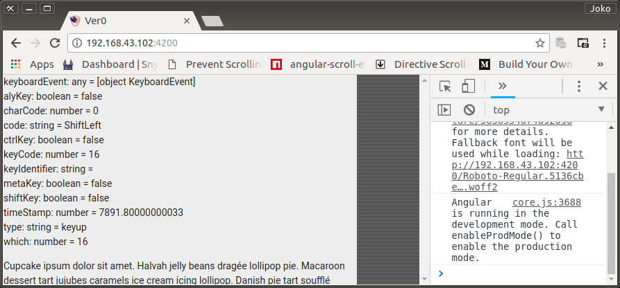
    <br />
    Figure: 004-m-keystroke.png
</p>

## Commit

```bash
$ git log --oneline

bf0effc (HEAD -> master, origin/master) Experimental Draggable Square
0016ff7 Experimental Lorem Ipsum
b8df69e Experimental Feature Module
c0e2efc Project Seed
40a3b30 chore: initial commit from @angular/cli

$ git add .
$ git commit -m "Experimental Side Navigator"
$ git push -u origin master
```